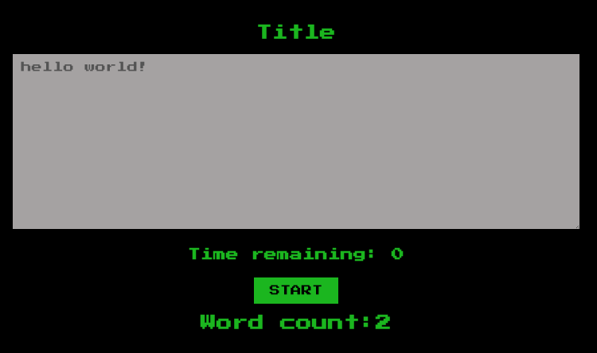

# Speed Typing Game

> A website on which can check how many words you can type in 1 minute.
>
> 👉 [Live demo](https://stefi.xyz/speed-typing-game/)




## Why I've build this?

Created this Web App following the [React Advance course on Scrimba](https://scrimba.com/) wanting to practice using React Hooks (useState, useRef, useEffect). The new things learned were the difference between `setInterval` and `setTimeout`.


## Technologies

This app was build with:

- [React](https://reactjs.org/docs/create-a-new-react-app.html) with `useState`, `useRef` and the `useEffect` Hook.


## Install and Play

```
git clone https://github.com/stefi23/speed-typing-game.git
$ cd speed-typing-game
$ npm install
$ npm start
```
